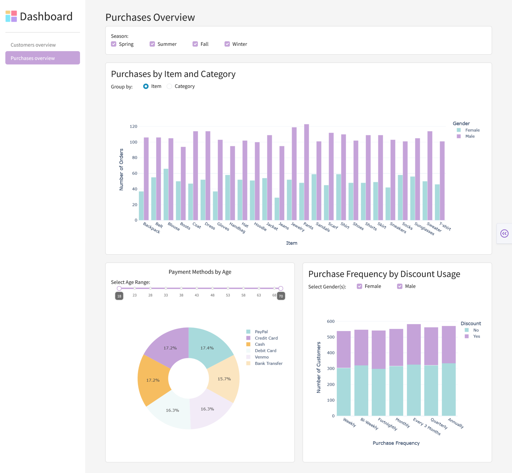

# Dash
* Open-source produkt od společnosti Plotly, vydán 2017 jako knihovna
* Low-code framework pro rychlé vytváření datových aplikací v Pythonu
* Postavený na Plotly.js, React, Flask
* [Dokumentace](https://dash.plotly.com)

## Instalace a nastavení prostředí
Vytvoříme si virtuální prostředí:

**Na školních počítačích nutno pracovat v Command Prompt (cmd) terminálu.**

Pro Windows:
```
python -m venv .venv
.venv\Scripts\Activate
```

Pro Linux/MacOS
```
python -m venv .venv
source .venv/bin/activate
```

Instalace (dash, dash-bootstrap-components, plotly_express, pandas):
```
pip install requirements.txt
```

### Struktura projektu
```
├── app.py
├── assets
│   ├── style.css
│   └── dashboard.png 
└── pages
    ├── customers.py
    └── purchases.py
```

***
# Dash multi-page app
## 1. Rozložení aplikace
Rozvržení aplikace sestává ze stromu komponent.

> Dash komponenty:
> * **Dash HTML**
>    * knihovna **dash_html_components** -- pro každý HTML tag obsahuje knihovna třídu komponenty
>    * parametry dash.html:
>        * `children` -- může obsahovat řetězec, číslo, komponentu či seznam komponent
>        * `style` -- jako html style, ale jedná se o slovník; camelCased (text-align -> textAlign)
>        * `className` -- ekvivalent pro html class
>    * [Seznam komponent](https://dash.plotly.com/dash-html-components)
>
> *  **Dash Core Componenty**
>    * knihovna **dash_core_components** -- tvorba interaktitivních komponent
>    * např.: grafy, dropdown, checklist, radio button, input, slider, vložení Markdown atd.
>
> *  **Dash Bootstrap Componenty**
>    *  knihovna **dash_bootstrap_components**
>        * style themes -- [Prohlížeč témat](https://dash-bootstrap-components.opensource.faculty.ai/docs/themes/explorer/)
>        * layout komponenty -- Container, Row, Col, Stack
>        * komponenty pro Button, Navbar, Form, Alert, Modal... -> [Přehled komponent](https://dash-bootstrap-components.opensource.faculty.ai/docs/components/)

### 1.1 `app.py`
Ve složce **dash** si založíme soubor **app.py**:
```python
import dash
import dash_bootstrap_components as dbc
from dash import Dash, dcc, html

app = Dash(__name__, use_pages=True, external_stylesheets=[dbc.themes.SPACELAB])
app.title = 'Dashboard'

SIDEBAR_STYLE = {
    "position": "fixed",
    "top": 0,
    "left": 0,
    "bottom": 0,
    "width": "16rem",
    "padding": "1rem 1rem",
    "background-color": "#f8f9fa",
}

CONTENT_STYLE = {
    "margin-left": "18rem",
    "margin-right": "2rem",
    "padding": "2rem 1rem",
}

sidebar = html.Div(
    [
        # title with icon
        dbc.Row([
            dbc.Col([
                dbc.Row([
                    dbc.Col(html.Img(src=app.get_asset_url('dashboard.png'), height='35px'), width='auto'),
                    dbc.Col(html.H1('Dashboard', style={'fontSize': '35px', 'margin': 0}))
                ], align='center', className='g-2')
            ])
        ], justify='start', align='center', style={'height': '65px'}),

        html.Hr(),
    ],
    className='sidebar', style=SIDEBAR_STYLE
)

app.layout = html.Div([
    dcc.Location(id='url'),
    sidebar,
    html.Div(dash.page_container, className='content', style=CONTENT_STYLE)
])

if __name__ == "__main__":
    app.run(debug=True)
```

<details>
    <summary>Porovnání HTML a dash.html</summary>
    HTML:
    <pre><code>&lt;h1 style="text-align: center; collor: #333333"&gt;Text nadpisu&lt;/h1&gt;</code></pre>    
    dash.html:
    <pre><code>html.H1('Text nadpisu', style={'textAlign': 'center', 'color': '#333333'})</code></pre>
</details>

### 1.2 Layout stránky 'Customers Overview'
Náhled stánky:


Ve složce `pages` založíme soubor `customers.py`

```python
import dash
from dash import dcc, html
import pandas as pd
import plotly.express as px
import dash_bootstrap_components as dbc

dash.register_page(__name__, path='/customers', name='Customers Overview')
```

Struktura komponent:


```python
layout = dbc.Container([
        html.H2('Customers Overview'),
        dbc.Card('Placeholder'),
        html.Br(),
        dbc.Row([
            dbc.Col(dbc.Card('Placeholder'), width=5, className='card_chart'),
            dbc.Col(dbc.Card('Placeholder'), width=7, className='card_chart')
        ]),
        html.Br(),
        dbc.Row([
            dbc.Col(dbc.Card('Placeholder'), width=7, className='card_chart'),
            dbc.Col(dbc.Card('Placeholder'), width=5, className='card_chart')
        ])
], fluid=True)
```

V `app.py` přidáme do `sidebar` navigační lištu:
```python
sidebar = html.Div(
    [
        # title with icon
        dbc.Row([
            dbc.Col([
                dbc.Row([
                    dbc.Col(html.Img(src=app.get_asset_url('dashboard.png'), height='35px'), width='auto'),
                    dbc.Col(html.H1('Dashboard', style={'fontSize': '35px', 'margin': 0}))
                ], align='center', className='g-2')
            ])
        ], justify='start', align='center', style={'height': '65px'}),

        html.Hr(),
        dbc.Nav([
            dbc.NavLink('Customers overview', href='/customers', active='exact'),
        ], vertical=True, pills=True)
    ], className='sidebar'
)
```

> Aby se nám stránka 'Customers' zobrazovala v 'Content' okně hned při načtení stránky, přidáme do `dcc.Location` v `app.layout` parametr `pathname`.
> ```python
> app.layout = html.Div([
>     dcc.Location(id='url', pathname='/customers'),
>     sidebar,
>     html.Div(dash.page_container, className='content')
> ])
> ```

## 2. Tvorba obsahu (grafy + další prvky)

V souboru `/pages/customers.py` si načteme dataset:
```python
df = pd.read_csv('../datasets/customers.csv', sep=',')
```

> #### Informace k datasetu:
>  Column           |  Dtype    |  Description
>  ------           |  -----    | ------
>   ID              |   int64   |   
>   Age             |   int64   | 
>   Gender          |   str     |
>   Item            |   str     | 
>   Category        |   str     |  Category of the item
>   Amount          |   int64   |  Purchase amount in USD
>   State_name      |   str     |
>   State_abbr      |   str     |
>   Size            |   str     |
>   Color           |   str     |
>   Season          |   str     |  Spring / Summer / Fall / Winter
>   Review_Rating   | float64   |
>   Subscription    | str       |  Subspciption satatus - Yes / No
>   Shipping        | str       |  Shipping type: method used to deliver the purchased item
>   Discount        | str       |  If was Discount Applied - Yes / No
>   Promo_code      | str       |  If was promo code used - Yes / No
>   Prev_pur        | int64     |  Number of previous purchases
>   Payment         | str       |  Payment method
>   Frequency       | str       |  Frequency of Purchases - Weekly, Bi-Weekly...

Obsah jednotlivých `dbc.Card` budeme pro přehlednost ukládat do proměnných, které se pak budou přidávat do proměnné `layout`.

* `season_filter` -- filtr ročního období pro všechny grafy na stránce:
    ```python
    season_filter = html.Div([
        html.Label('Season: '),
        dbc.Checklist(
            id='season_filter',
            options=['Spring', 'Summer', 'Fall', 'Winter'],
            value=['Spring', 'Summer', 'Fall', 'Winter'],
            inline=True,
            input_checked_style={
                    "backgroundColor": "#C5a3D9",
                    "borderColor": "#C5a3D9"},
            className='checklist'
        ), 
    ], className='select_row')
    ```
* `gender_card` -- graf zobrazující rozložení pohlaví zákazníků
    ```python
    gender_card = dbc.Card([
        dbc.CardBody([
            html.H3('Gender'),
            dbc.Row(
                dcc.Dropdown(
                    id='location_dropdown',
                    options=[{'label': loc, 'value': loc} for loc in sorted(df['State_name'].unique())],
                    value=df['State_name'].unique()[0],
                    className='dropdown'
                     ),
                ),
            dcc.Graph(id='gender_pie')
        ])
    ], className='h-100')
    ```

* `location_card` -- choropleth zobrazujíc odkud zákazníci jsou
    ```python
    location_card = dbc.Card([
        dbc.CardBody([
            html.H3('Location'),
            html.Label('Select age range: '),
            dcc.RangeSlider(
                id='age_range',
                min=int(df['Age'].min()),
                max=int(df['Age'].max()),
                step=1,
                value=[int(df['Age'].min()), int(df['Age'].max())],
                marks={i: str(i) for i in range(int(df['Age'].min()), int(df['Age'].max()) + 1, 5)},
                tooltip={"placement": "bottom", "always_visible": True},
                className='slider'
            ),
            dcc.Graph(id='location_choropleth')
        ])
    ],)
    ```
* `review_card` - graf zobrazující hodnocení v závislosti na částně objednávky
    ```python
    review_card = dbc.Card(
        dbc.CardBody([
            html.H3('Review Rating vs Amount'),
            dcc.Graph(id='review_line')
        ])
    )
    ```

* `age_card` - graf zobrazující věkové rozložení zákazníků
    ```python
    age_card = dbc.Card(
        dbc.CardBody([
            html.H3('Age'),
            html.Div([
                html.Label('Select gender: '),
                dbc.RadioItems(
                    id='gender_radio',
                    options=[{'label': g, 'value': g} for g in df['Gender'].unique()],
                    value=df['Gender'].unique()[0],
                    inline=True,
                    className='radio'
                ), 
            ], className='select-row'),
            dcc.Graph(id='age_hist')
        ]), className='h-100'
    )
    ```
Layout:
```python
layout = dbc.Container([
        html.H2('Customers Overview'),
        dbc.Card(dbc.CardBody(season_filter)),
        html.Br(),
        dbc.Row([
            dbc.Col(gender_card, width=5, className='card_chart'),
            dbc.Col(location_card, width=7, className='card_chart')
        ]),
        html.Br(),
        dbc.Row([
            dbc.Col(review_card, width=7, className='card_chart'),
            dbc.Col(age_card, width=5, className='card_chart')
        ])
],fluid=True)
```

## 4. Callback
Z modulu `dash` naimportujeme:
```python
from dash import Input, Output
```
V sekci pod `layout` nadefinujeme dekorátor `@dash.callback` s Outputy a Inputy.

Prvním parametrem Inptu/Outputu je `component_id`, druhým je `component_property` dle charakteru komponenty (např.: `value`, `figure`, `children`).
Dash volá funkci definovanou pod dekorátorem vždy, když se změní vlastnost vstupní komponenty, aby se aktualizovala vlastnost v jiné výstupní komponentě. 
Pořadí Inputů odpovídá vstupům funkce a návratové hodnoty funkce odpovídají Ouputům (Tzn. Pořadí je důležité).

```python
@dash.callback(
    Output('gender_pie', 'figure'),
    Output('location_choropleth', 'figure'),
    Output('review_line', 'figure'),
    Output('age_hist', 'figure'),
    Input('season_filter', 'value'),
    Input('location_dropdown', 'value'),
    Input('gender_radio', 'value'),
    Input('age_range', 'value')
)
```

### Tvorba grafů

Komponenta `dcc.Graph` vykresluje vizualizace dat pomocí grafů předané jako argument `figure`.

Funkce pod dekorátorem `@dash.callback` vrací `figure` pro jednotlivé grafy. Do funkce vstupují parametry v pořadí určení Inputů. Funkce musí vracet grafy v pořadí, jak jsou definované v Outputech (potažmo v `layout`).


## 5. Stylování

Barevnou paletu (a plotly.theme) pro grafy si můžeme globálně nastavit v souboru `app.py`:
```python
import plotly.io as pio

pio.templates['pastel_trio'] = pio.templates['plotly_white']
pio.templates['pastel_trio'].layout.colorway = ["#A8DADC", "#C5a3D9", "#F6BD60"]
pio.templates.default = 'pastel_trio'
```

Další dostylování můžeme provést např. pomocí CSS, tyto soubory uložené ve složce `assets` se automaticky při spušťění načítají.

Soubor `style.css`
```css
:root {
    --color-blue: #A8DADC;
    --color-purple: #C5a3D9;
    --color-salmon: #FB8089 ;
}

body{
    background-color: #f5f5f5;
}

.content{
    margin-left: 18rem;
    margin-right: 2rem;
    padding: 2rem 1rem;
    display: flex;
    flex-direction: column;
    min-height: 100vh;
}

.sidebar{
    position: fixed;
    top: 0;
    left: 0;
    bottom: 0;
    width: 16rem;
    padding: 1rem 1rem;
    background-color: #ffffff;

}

.nav-pills .nav-link{
    color: #777777;
}

.nav-pills .nav-link.active{
    background-color: var(--color-purple);
    color: white;
}

.card-title{
    text-align: center;
    font-size: 18px;
}

.card-chart{
    height: 500px;
}

.select-row {
    display: flex;
    align-items: center;
    gap: 2rem;
}


input[type='radio']{
    margin: 0.3rem;
}

input[type='checkbox']{
    margin: 0.3rem;
}

.checklist label {
    margin-right: 2rem;
}

.radio label{
    margin-right: 2rem;
}
.radio-button{
    background-color: white;
    border: solid 2px #C5a3D9;
    accent-color: #C5a3D9;
}

.slider .rc-slider-track{
    background-color: var(--color-purple);
}
  
.slider .rc-slider-dot-active {  
    border-color: lightgray;
    border: solid 2px lightgray;
  }
  
.slider  .rc-slider-handle {
    background-color: white;
    border-color: var(--color-purple);
  }
```

## 6. Úkol
Vytvořte novou stránku 'Purchases Overview'.

**Náhled stránky:**



**Struktura komponent:**


### Popis:
* Filtr ročního období pro všechny grafy na stránce
* Graf 1: Barplot zobrazující počet objednávek učiněných muži nebo ženami (sloupec 'Gender') buď dle položek (sloupec 'Item') nebo kategorií položek ('sloupec 'Category'). Filtr seskupení -- radio button.
 
* Graf 2: Donut chart zobrazující použité platební metody (sloupec 'Payment'), kde lze pomocí Slideru filtrovat věkové rozpětí (sloupce 'Age')
* Graf 3: Skládaný (stacked) Barplot zobrazující zastoupení objednávek v jednotlivých frekvencích nákupu ('sloupec 'Frequency') na základě uplatnění slevy (sloupec 'Discount'; hodnoty Yes/No). V grafu lze filtrovat data dle pohlaví (sloupec 'Gender') pomocí Chechbutton.
    * zde je seznam logicky seřazených možností frekvencí nákupu:
        ```python
        freq_order = ['Weekly','Bi-Weekly', 'Fortnightly', 'Monthly', 'Every 3 Months', 'Quarterly', 'Annually']
        ```

### Nápovědy a řešení
**Layout a komponenty Card:**
-   <details>
    <summary>Řešení: Layout</summary>

    ```python
    layout = dbc.Container([
        html.H2('Purchases Overview'),
        dbc.Card(dbc.CardBody(season_filter)),
        html.Br(),
        dbc.Row(dbc.Col(item_category_card, className='card_chart')),
        html.Br(),
        dbc.Row([
            dbc.Col(payment_card, width=6, className='card_chart'),
            dbc.Col(freq_card, width=6, className='card_chart')
        ]),
    ], fluid=True)
    ```
    </details>

    ---

    <details>
    <summary>Řešení: dbc.Card s grafem pro Items-Category</summary>

    ```python
    item_category_card = dbc.Card([
        dbc.CardBody([
            html.H3('Purchases by Item and Category'),
            html.Div([
                html.Label('Group by: '),
                dbc.RadioItems(
                    id='group_by',
                    options=[
                        {'label': 'Item', 'value': 'Item'},
                        {'label': 'Category', 'value': 'Category'}],
                        value='Item',
                        inline=True,
                    )
            ], className='select-row'),
            html.Br(),
            dcc.Graph(id='orders_bar')
        ])
    ])
    ```
    </details>

    ---

    <details>
    <summary>Řešení: dbc.Card s grafem sledující frekvenci nakupování</summary>

    ```python
    freq_card = dbc.Card([
        dbc.CardBody([
            html.H3('Purchase Frequency by Discount Usage'),
            html.Div([
                html.Label('Select Gender(s): '),
                dbc.Checklist(
                    id='gender_filter',
                    options=[{'label': g, 'value': g} for g in sorted(df['Gender'].unique())],
                    value=df['Gender'].unique().tolist(),
                    inline=True,
                    input_checked_style={
                        'backgroundColor': '#C5a3D9',
                        'borderColor': '#C5a3D9'},
                    className='checklist'
                ),
            ], className='select-row'),
            html.Br(),
            dcc.Graph(id='discount_freq_bar')
        ])
    ], className='h-100')
    ```
    </details>

    ---

    <details>
    <summary>Řešení: dbc.Card s grafem pro platební metody</summary>

    ```python
    payment_card = dbc.Card([
        dbc.CardBody([
            html.H3('Payment Methods by Age'),
            html.Label('Select Age Range: '),
            dcc.RangeSlider(
                id='age_range',
                min=int(df['Age'].min()),
                max=int(df['Age'].max()),
                step=1,
                value=[int(df['Age'].min()), int(df['Age'].max())],
                marks={i: str(i) for i in range(int(df['Age'].min()), int(df['Age'].max()) + 1, 5)},
                tooltip={'placement': 'bottom', 'always_visible': True},
                className='slider'
            ),
            html.Br(),
            dcc.Graph(id='payment_donut')
        ])
    ], className='h-100')
    ```
    </details>

---
**Callback a grafy:**
* Graf 1 - Grouped Barplot Items-Category
   <details>
    <summary>Nápověda</summary>
    <ul>
        <li><code>plotly.express.bar(df, x, y, mode='group')</code></li>
    <ul>
    </details>

    <details>
    <summary>Řešení</summary>

    ```python
    @dash.callback(
        Output({id_graph}, 'figure')
        Input({id_season_filtr}, 'value')
        Input({id_group_by}, 'value'))
    def update_graph(selected_seasons, group_by):
        # Filtr season
        dff = df[df['Season'].isin(selected_seasons)]

        grouped = dff.groupby([group_by, 'Gender']).size().reset_index(name='Count')

        fig_bar_item_cat = px.bar(grouped, x=group_by
        y='Count', color='Gender', barmode='group')
        fig_bar_item_cat.update_layout(xaxis_title=group_by, yaxis_title='Number of Orders')

        return fig_bar_item_cat
    ```
    </details>

    ---
* Graf 2 - Stacked Barplot Frequency-Discount
   <details>
    <summary>Nápověda</summary>
    <ul>
        <li><code>plotly.express.bar(df, x, y, mode='stack')</code></li>
    <ul>
    </details>
    <details>
    <summary>Řešení</summary>

    ```python
    @dash.callback(
        Output({id_graph}, 'figure')
        Input({id_season_filtr}, 'value')
        Input({id_gender_filter}, 'value'))
    def update_graph(selected_seasons, selected_genders):
        # Filtr season
        dff = df[df['Season'].isin(selected_seasons)]
         
        dff = df[df['Gender'].isin(selected_genders)]
        freq_counts = dff.groupby(['Frequency', 'Discount']).size().reset_index(name='Count')

        freq_order = ['Weekly','Bi-Weekly', 'Fortnightly', 'Monthly', 'Every 3 Months', 'Quarterly', 'Annually']
        freq_counts['Frequency'] = pd.Categorical(freq_counts['Frequency'], categories=freq_order, ordered=True)
        freq_counts = freq_counts.sort_values('Frequency')

        fig_bar_freq = px.bar(freq_counts,
                    x='Frequency', y='Count', color='Discount',
                    barmode='stack',
                    labels={'Frequency': 'Purchase Frequency', 'Count': 'Number of Customers'})
        
        return fig_bar_freq
    ```
    </details>

    ---
* Graf 3 - Donut chart Payment method
   <details>
    <summary>Nápověda</summary>
    <ul>
        <li>Vytvoření donut chart pomocí pie chart s parametrem 'hole': <code>plotly.express.pie(df, names='Column', values='Column', hole={float})</code></li>
    <ul>
    </details>
    <details>
    <summary>Řešení: Graf 3</summary>

    ```python
    @dash.callback(
        Output({id_graph}, 'figure')
        Input({id_season_filtr}, 'value')
        Input({id_age_rande}, 'value'))
    def update_graph(selected_seasons, age_range):
        # Filtr season
        dff = df[df['Season'].isin(selected_seasons)]
        
        min_age, max_age = age_range
        dff = df[(df['Age'] >= min_age) & (df['Age'] <= max_age)]

        payment_counts = dff['Payment'].value_counts().reset_index()
        payment_counts.columns = ['Payment Method', 'Count']

        fig_donut = px.pie(payment_counts,
                    names='Payment Method',
                    values='Count',
                    hole=0.4)

        return fig_donut
    ```
    </details>
---