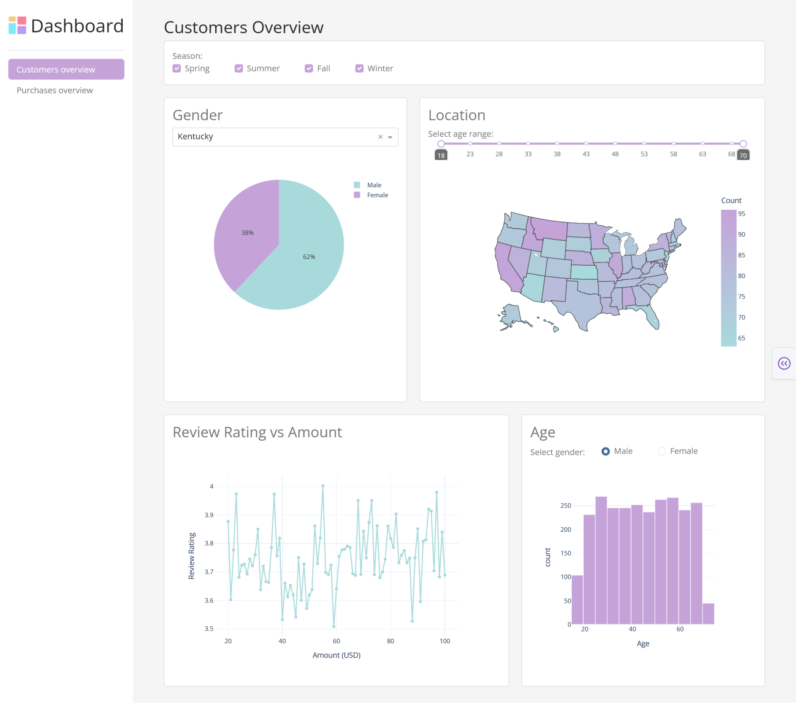
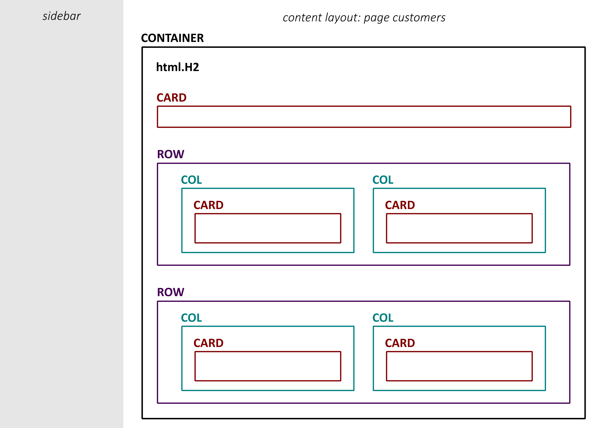
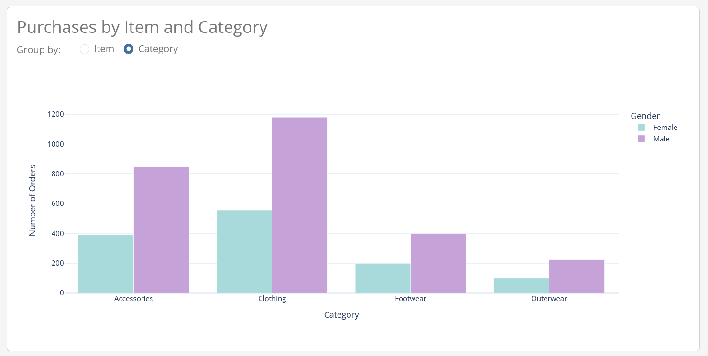

# Dash
* Open-source product by Plotly, released in 2017 as a library
* Low-code framework for rapid creation of data apps in Python
* Built on Plotly.js, React, Flask
* [Documentation](https://dash.plotly.com)

## Installation and environment setup
Create a virtual environment:

**On school computers, use the Command Prompt (cmd) terminal.**

For Windows:
```
python -m venv .venv
.venv\Scripts\Activate
```

For Linux/MacOS:
```
python -m venv .venv
source .venv/bin/activate
```

Install required libraries (dash, dash-bootstrap-components, plotly_express, pandas):
```
pip install -r requirements.txt
```

### Project structure
```
├── app.py
├── assets
│   ├── style.css
│   └── dashboard.png 
└── pages
    ├── customers.py
    └── purchases.py
```

***
# Dash multi-page app
## 1. App Layout
App layout consists of a component tree.

> Dash components:
> * **Dash HTML**
>    * **dash_html_components** library — provides a class for each HTML tag
>    * dash.html parameters:
>        * `children` — can contain string, number, a component or a list of components
>        * `style` — like HTML style, but it’s a dictionary; camelCased (text-align -> textAlign)
>        * `className` — equivalent to the HTML class attribute
>    * [Component list](https://dash.plotly.com/dash-html-components)
>
> *  **Dash Core Components**
>    * **dash_core_components** library — used to create interactive components
>    * e.g. graphs, dropdowns, checklists, radio buttons, input, slider, Markdown display, etc.
>
> *  **Dash Bootstrap Components**
>    *  **dash_bootstrap_components** library
>        * style themes — [Theme explorer](https://dash-bootstrap-components.opensource.faculty.ai/docs/themes/explorer/)
>        * layout components — Container, Row, Col, Stack
>        * components for Button, Navbar, Form, Alert, Modal... -> [Component overview](https://dash-bootstrap-components.opensource.faculty.ai/docs/components/)

### 1.1 `app.py`
Create a file called **app.py** in your **dash** folder:
```python
import dash
import dash_bootstrap_components as dbc
from dash import Dash, dcc, html

app = Dash(__name__, use_pages=True, external_stylesheets=[dbc.themes.SPACELAB])
app.title = 'Dashboard'
app._favicon = ('./dashboard.png')

SIDEBAR_STYLE = {
    "position": "fixed",
    "top": 0,
    "left": 0,
    "bottom": 0,
    "width": "16rem",
    "padding": "1rem 1rem",
    "background-color": "#f8f9fa",
}

CONTENT_STYLE = {
    "margin-left": "18rem",
    "margin-right": "2rem",
    "padding": "2rem 1rem",
}

sidebar = html.Div(
    [
        # title with icon
        dbc.Row([
            dbc.Col([
                dbc.Row([
                    dbc.Col(html.Img(src=app.get_asset_url('dashboard.png'), height='35px'), width='auto'),
                    dbc.Col(html.H1('Dashboard', style={'fontSize': '35px', 'margin': 0}))
                ], align='center', className='g-2')
            ])
        ], justify='start', align='center', style={'height': '65px'}),

        html.Hr(),
    ],
    className='sidebar', style=SIDEBAR_STYLE
)

app.layout = html.Div([
    dcc.Location(id='url'),
    sidebar,
    html.Div(dash.page_container, className='content', style=CONTENT_STYLE)
])

if __name__ == "__main__":
    app.run(debug=True)
```

<details>
    <summary>HTML vs dash.html comparison</summary>
    HTML:
    <pre><code>&lt;h1 style="text-align: center; color: #333333"&gt;Heading text&lt;/h1&gt;</code></pre>    
    dash.html:
    <pre><code>html.H1('Heading text', style={'textAlign': 'center', 'color': '#333333'})</code></pre>
</details>

### 1.2 Page layout: 'Customers Overview'
Preview of the page:



In the `pages` folder, create a file named `customers.py`:

```python
import dash
from dash import dcc, html
import pandas as pd
import plotly.express as px
import dash_bootstrap_components as dbc

dash.register_page(__name__, path='/customers', name='Customers Overview')
```

Component structure:



```python
layout = dbc.Container([
        html.H2('Customers Overview'),
        dbc.Card('Placeholder'),
        html.Br(),
        dbc.Row([
            dbc.Col(dbc.Card('Placeholder'), width=5, className='card_chart'),
            dbc.Col(dbc.Card('Placeholder'), width=7, className='card_chart')
        ]),
        html.Br(),
        dbc.Row([
            dbc.Col(dbc.Card('Placeholder'), width=7, className='card_chart'),
            dbc.Col(dbc.Card('Placeholder'), width=5, className='card_chart')
        ])
], fluid=True)
```

Add navigation links to the `sidebar` in `app.py`:
```python
sidebar = html.Div(
    [
        # title with icon
        dbc.Row([
            dbc.Col([
                dbc.Row([
                    dbc.Col(html.Img(src=app.get_asset_url('dashboard.png'), height='35px'), width='auto'),
                    dbc.Col(html.H1('Dashboard', style={'fontSize': '35px', 'margin': 0}))
                ], align='center', className='g-2')
            ])
        ], justify='start', align='center', style={'height': '65px'}),

        html.Hr(),
        dbc.Nav([
            dbc.NavLink('Customers overview', href='/customers', active='exact'),
        ], vertical=True, pills=True)
    ], className='sidebar'
)
```

> To ensure the 'Customers' page loads by default, add a `pathname` to `dcc.Location` in `app.layout`:
> ```python
> app.layout = html.Div([
>     dcc.Location(id='url', pathname='/customers'),
>    sidebar,
>    html.Div(dash.page_container, className='content')
>])
>```

## 2. Creating content (charts + elements)

In `/pages/customers.py`, load the dataset:
```python
df = pd.read_csv('../datasets/customers.csv', sep=',')
```

> #### Dataset info:
>  Column         |  Dtype    |  Description
>  -------------- | --------- | --------------------------
>  ID             | int64     | 
>  Age            | int64     | 
>  Gender         | str       |
>  Item           | str       | 
>  Category       | str       |  Category of the item
>  Amount         | int64     |  Purchase amount in USD
>  State_name     | str       |
>  State_abbr     | str       |
>  Size           | str       |
>  Color          | str       |
>  Season         | str       |  Spring / Summer / Fall / Winter
>  Review_Rating  | float64   |
>  Subscription   | str       |  Subscription status - Yes / No
>  Shipping       | str       |  Shipping type
>  Discount       | str       |  Was discount applied - Yes / No
>  Promo_code     | str       |  Was promo code used - Yes / No
>  Prev_pur       | int64     |  Number of previous purchases
>  Payment        | str       |  Payment method
>  Frequency      | str       |  Purchase frequency - Weekly, Bi-Weekly...

For clarity, we will store the contents of individual `dbc.Card` in variables, which will then be added to the `layout` variable.

* `season_filter` — filter for seasons used across all charts:
    ```python
    season_filter = html.Div([
        html.Label('Season:'),
        dbc.Checklist(
            id='season_filter',
            options=['Spring', 'Summer', 'Fall', 'Winter'],
            value=['Spring', 'Summer', 'Fall', 'Winter'],
            inline=True,
            input_checked_style={
                "backgroundColor": "#C5a3D9",
                "borderColor": "#C5a3D9"},
            className='checklist'
        ), 
    ], className='select_row')
    ```

* `gender_card` — gender distribution chart:
    ```python
    gender_card = dbc.Card([
        dbc.CardBody([
            html.H3('Gender'),
            dcc.Dropdown(
                id='location_dropdown',
                options=[{'label': loc, 'value': loc} for loc in sorted(df['State_name'].unique())],
                value=df['State_name'].unique()[0],
                className='dropdown'
                ),
            dcc.Graph(id='gender_pie')
        ])
    ], className='h-100')
    ```

* `location_card` — choropleth map:
    ```python
    location_card = dbc.Card([
        dbc.CardBody([
            html.H3('Location'),
            html.Label('Select age range:'),
            dcc.RangeSlider(
                id='age_range',
                min=int(df['Age'].min()),
                max=int(df['Age'].max()),
                step=1,
                value=[int(df['Age'].min()), int(df['Age'].max())],
                marks={i: str(i) for i in range(int(df['Age'].min()), int(df['Age'].max()) + 1, 5)},
                tooltip={'placement': 'bottom', 'always_visible': True},
                className='slider'
            ),
            dcc.Graph(id='location_choropleth')
        ])
    ])
    ```

* `review_card` — rating vs amount:
    ```python
    review_card = dbc.Card(
        dbc.CardBody([
            html.H3('Review Rating vs Amount'),
            dcc.Graph(id='review_line')
        ])
    )
    ```

* `age_card` — age distribution:
    ```python
    age_card = dbc.Card(
        dbc.CardBody([
            html.H3('Age'),
            html.Div([
                html.Label('Select gender:'),
                dbc.RadioItems(
                    id='gender_radio',
                    options=[{'label': g, 'value': g} for g in df['Gender'].unique()],
                    value=df['Gender'].unique()[0],
                    inline=True,
                    className='radio'
                ), 
            ], className='select-row'),
            dcc.Graph(id='age_hist')
        ]), className='h-100'
    )
    ```

Layout:
```python
layout = dbc.Container([
        html.H2('Customers Overview'),
        dbc.Card(dbc.CardBody(season_filter)),
        html.Br(),
        dbc.Row([
            dbc.Col(gender_card, width=5, className='card_chart'),
            dbc.Col(location_card, width=7, className='card_chart')
        ]),
        html.Br(),
        dbc.Row([
            dbc.Col(review_card, width=7, className='card_chart'),
            dbc.Col(age_card, width=5, className='card_chart')
        ])
], fluid=True)
```

## 4. Callback
From the `dash` module, import:
```python
from dash import Input, Output
```
In the section under `layout` we define the decorator `@dash.callback` with Outputs and Inputs.

The first parameter of Input/Output is `component_id`, the second is `component_property` according to the character of the component (e.g. `value`, `figure`, `children`).
Dash calls the function defined under the decorator whenever the property of the input component changes, in order to update the property in the output component.
The order of Inputs corresponds to the inputs of the function and the return values ​​of the function correspond to the Outputs (i.e. the order is important).

```python
@dash.callback(
    Output('gender_pie', 'figure'),
    Output('location_choropleth', 'figure'),
    Output('review_line', 'figure'),
    Output('age_hist', 'figure'),
    Input('season_filter', 'value'),
    Input('location_dropdown', 'value'),
    Input('gender_radio', 'value'),
    Input('age_range', 'value')
)
```

### Creating charts
The `dcc.Graph` component renders data visualizations using graphs passed as the `figure` argument.

The function under the `@dash.callback` decorator returns `figure` for each graph. The parameters are entered into the function in the order specified in the Inputs. The function must return the graphs in the order as defined in the Outputs (and therefore in the `layout`).

```python
def update_graphs(seasons, selected_location, selected_gender, selected_age_range):
    dff = df[df['Season'].isin(seasons)]

    # Gender Pie
    pie_df = dff[dff['State_name'] == selected_location]
    fig_pie = px.pie(pie_df, names='Gender')
    fig_pie.update_layout(height=400)

    # Choropleth map (grouped and counted by state)
    pastel_colorscale = [[0.0, '#A8DADC'], [1.0, '#C5a3D9']] 
    min_age, max_age = selected_age_range
    age_df = dff[(dff['Age'] >= min_age) & (dff['Age'] <= max_age)]
    age_df = age_df.groupby('State_abbr').size().reset_index(name='Count')
    fig_map = px.choropleth(
        age_df,
        locations='State_abbr',
        locationmode='USA-states',
        scope='usa',
        color='Count',
        color_continuous_scale=pastel_colorscale)
    fig_map.update_layout(height=450)

    # Average Review Rating Line Chart
    agg_df = dff.groupby('Amount')['Review_Rating'].mean().reset_index()
    fig_line = px.line(agg_df, x='Amount', y='Review_Rating', markers=True)
    fig_line.update_layout(xaxis_title='Amount (USD)', yaxis_title='Average Review Rating', height=450)

    # Age Histogram
    gender_df = dff[dff['Gender'] == selected_gender]
    fig_hist = px.histogram(gender_df, x='Age', nbins=20)
    fig_hist.update_layout(height=400)
    fig_hist.update_traces(marker_color='#C5a3D9', marker_line_width=1, marker_line_color='white')

    return fig_pie, fig_map, fig_line, fig_hist
```

## 5. Styling
Set the color palette and plotly.theme globally in `app.py`:
```python
import plotly.io as pio

pio.templates['pastel_trio'] = pio.templates['plotly_white']
pio.templates['pastel_trio'].layout.colorway = ["#A8DADC", "#C5a3D9", "#F6BD60"]
pio.templates.default = 'pastel_trio'
```

Extra styling can be added via CSS — files in the `assets` folder are automatically loaded.

File: `style.css`
```css
:root {
    --color-blue: #A8DADC;
    --color-purple: #C5a3D9;
    --color-salmon: #FB8089 ;
}

body{
    background-color: #f5f5f5;
}

.content{
    margin-left: 18rem;
    margin-right: 2rem;
    padding: 2rem 1rem;
    display: flex;
    flex-direction: column;
    min-height: 100vh;
}

.sidebar{
    position: fixed;
    top: 0;
    left: 0;
    bottom: 0;
    width: 16rem;
    padding: 1rem 1rem;
    background-color: #ffffff;
}

.nav-pills .nav-link{
    color: #777777;
}

.nav-pills .nav-link.active{
    background-color: var(--color-purple);
    color: white;
}

.card-title{
    text-align: center;
    font-size: 18px;
}

.card-chart{
    height: 500px;
}

.select-row {
    display: flex;
    align-items: center;
    gap: 2rem;
}

input[type='radio']{
    margin: 0.3rem;
}

input[type='checkbox']{
    margin: 0.3rem;
}

.checklist label {
    margin-right: 2rem;
}

.radio label{
    margin-right: 2rem;
}
.radio-button{
    background-color: white;
    border: solid 2px #C5a3D9;
    accent-color: #C5a3D9;
}

.slider .rc-slider-track{
    background-color: var(--color-purple);
}
  
.slider .rc-slider-dot-active {  
    border-color: lightgray;
    border: solid 2px lightgray;
  }
  
.slider  .rc-slider-handle {
    background-color: white;
    border-color: var(--color-purple);
  }
```

## 6. Task  
Create a new page called **'Purchases Overview'**.

**Preview of the page:**


**Component structure:**


### Description:
* Season filter for all charts on the page
* **Chart 1**: Barplot showing the number of orders made by men or women (column 'Gender') either by items (column 'Item') or by item categories ('column 'Category'). Grouping filter -- radio button.
 
* **Chart 2**: Donut chart showing the payment methods used (column 'Payment'), where you can use the Slider to filter by age range (column 'Age')
* **Chart 3**: Stacked Barplot showing the representation of orders in individual purchase frequencies (column 'Frequency') based on the application of a discount (column 'Discount'; values ​​Yes/No). In the chart, you can filter data by gender (column 'Gender') using the Chechbutton.
    * here is a list of logically ordered purchase frequency options:
    ```python
    freq_order = ['Weekly','Bi-Weekly', 'Fortnightly', 'Monthly', 'Every 3 Months', 'Quarterly', 'Annually']
    ```

### Helps and solutions

**Layout and Card Components:**
- <details>
  <summary>Solution: Layout</summary>

  ```python
  layout = dbc.Container([
      html.H2('Purchases Overview'),
      dbc.Card(dbc.CardBody(season_filter)),
      html.Br(),
      dbc.Row(dbc.Col(item_category_card, className='card_chart')),
      html.Br(),
      dbc.Row([
          dbc.Col(payment_card, width=6, className='card_chart'),
          dbc.Col(freq_card, width=6, className='card_chart')
      ]),
  ], fluid=True)
  ```
  </details>

    ---

    <details>
    <summary>Solution: dbc.Card with Item-Category Chart</summary>

    ```python
    item_category_card = dbc.Card([
        dbc.CardBody([
            html.H3('Purchases by Item and Category'),
            html.Div([
                html.Label('Group by:'),
                dbc.RadioItems(
                    id='group_by',
                    options=[
                        {'label': 'Item', 'value': 'Item'},
                        {'label': 'Category', 'value': 'Category'}
                    ],
                    value='Item',
                    inline=True,
                )
            ], className='select-row'),
            html.Br(),
            dcc.Graph(id='orders_bar')
        ])
    ])
    ```
    </details>

    ---

    <details>
    <summary>Solution: dbc.Card with Purchase Frequency Chart</summary>

    ```python
    freq_card = dbc.Card([
        dbc.CardBody([
            html.H3('Purchase Frequency by Discount Usage'),
            html.Div([
                html.Label('Select Gender(s):'),
                dbc.Checklist(
                    id='gender_filter',
                    options=[{'label': g, 'value': g} for g in sorted(df['Gender'].unique())],
                    value=df['Gender'].unique().tolist(),
                    inline=True,
                    input_checked_style={
                        'backgroundColor': '#C5a3D9',
                        'borderColor': '#C5a3D9'
                    },
                    className='checklist'
                ),
            ], className='select-row'),
            html.Br(),
            dcc.Graph(id='discount_freq_bar')
        ])
    ], className='h-100')
    ```
    </details>

    ---

    <details>
    <summary>Solution: dbc.Card with Payment Method Chart</summary>

    ```python
    payment_card = dbc.Card([
        dbc.CardBody([
            html.H3('Payment Methods by Age'),
            html.Label('Select Age Range: '),
            dcc.RangeSlider(
                id='age_range',
                min=int(df['Age'].min()),
                max=int(df['Age'].max()),
                step=1,
                value=[int(df['Age'].min()), int(df['Age'].max())],
                marks={i: str(i) for i in range(int(df['Age'].min()), int(df['Age'].max()) + 1, 5)},
                tooltip={'placement': 'bottom', 'always_visible': True},
                className='slider'
            ),
            html.Br(),
            dcc.Graph(id='payment_donut')
        ])
    ], className='h-100')
    ```
    </details>

---

**Callback and charts:**

* Chart 1 — Grouped Barplot: Items-Category
  <details>
  <summary>Help</summary>
  <code>plotly.express.bar(df, x, y,  color='Gender', barmode='group')</code>
  </details>

  <details>
  <summary>Solution</summary>

  ```python
  @dash.callback(
    Output({id_graph}, 'figure'),
    Input({id_season_filter}, 'value'),
    Input({id_group_by}, 'value'))
  def update_graph(selected_seasons, group_by):
    # Filter by season
    dff = df[df['Season'].isin(selected_seasons)]

    grouped = dff.groupby([group_by, 'Gender']).size().reset_index(name='Count')

    fig_bar_item_cat = px.bar(grouped, x=group_by, y='Count', color='Gender', barmode='group')
    fig_bar_item_cat.update_layout(xaxis_title=group_by, yaxis_title='Number of Orders')

    return fig_bar_item_cat
  ```
  </details>

---

* Chart 2 — Stacked Barplot: Frequency-Discount
  <details>
  <summary>Help</summary>
  <code>plotly.express.bar(df, x, y, color='Discount', barmode='stack')</code><br>
  Ordering values ​​on the x-axis: <code>figure.update_xaxes(categoryorder='array', categoryarray=['Weekly','Bi-Weekly', 'Fortnightly', 'Monthly', 'Every 3 Months', 'Quarterly', 'Annually'])</code>
  </details>

  <details>
  <summary>Solution</summary>

  ```python
    @dash.callback(
        Output({id_graph}, 'figure'),
        Input({id_season_filter}, 'value'),
        Input({id_gender_filter}, 'value'))
    def update_graph(selected_seasons, selected_genders):
        # Filter by season and gender
        dff = df[df['Season'].isin(selected_seasons)]
        dff = dff[dff['Gender'].isin(selected_genders)]

        freq_counts = dff.groupby(['Frequency', 'Discount']).size().reset_index(name='Count')
        
        fig_bar_freq = px.bar(freq_counts,
                        x='Frequency', y='Count', color='Discount',
                        barmode='stack',
                        labels={'Frequency': 'Purchase Frequency', 'Count': 'Number of Customers'})
        fig_bar_freq.update_xaxes(categoryorder='array', categoryarray=['Weekly','Bi-Weekly', 'Fortnightly', 'Monthly', 'Every 3 Months', 'Quarterly', 'Annually'])

        return fig_bar_freq
  ```
  </details>

---

* Chart 3 — Donut Chart: Payment Method
  <details>
  <summary>Help</summary>
  Create a donut chart using pie chart with the 'hole' parameter: <code>plotly.express.pie(df, names='Column', values='Column', hole={float})</code>
  </details>

  <details>
  <summary>Solution</summary>

  ```python
  @dash.callback(
      Output({id_graph}, 'figure'),
      Input({id_season_filter}, 'value'),
      Input({id_age_range}, 'value'))
  def update_graph(selected_seasons, age_range):
      # Filter by season and age
      dff = df[df['Season'].isin(selected_seasons)]
      min_age, max_age = age_range
      dff = dff[(dff['Age'] >= min_age) & (dff['Age'] <= max_age)]

      payment_counts = dff['Payment'].value_counts().reset_index()
      payment_counts.columns = ['Payment Method', 'Count']

      fig_donut = px.pie(payment_counts,
                         names='Payment Method',
                         values='Count',
                         hole=0.4)

      return fig_donut
  ```
  </details>