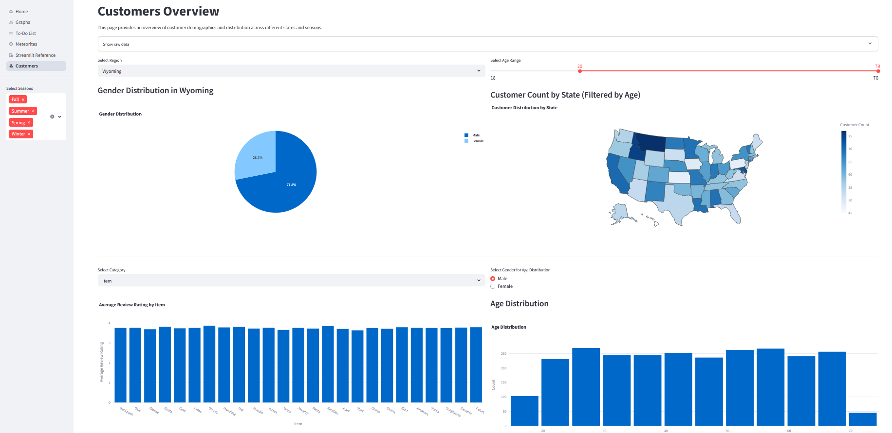
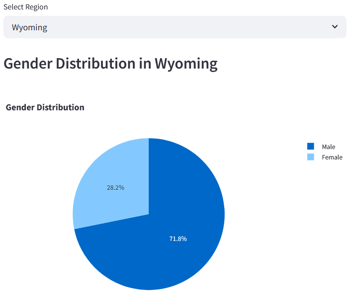
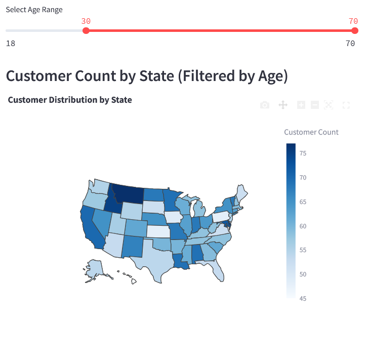
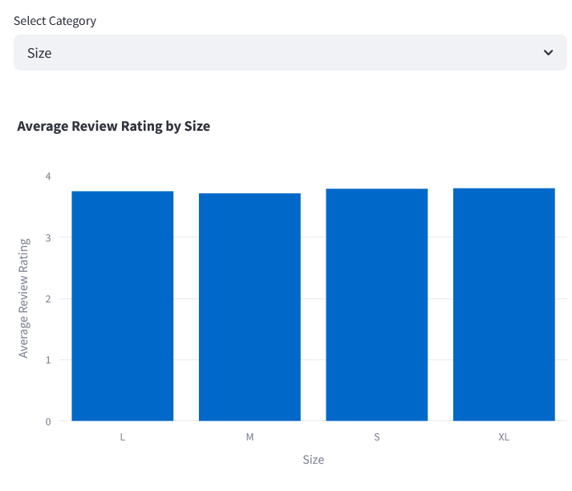
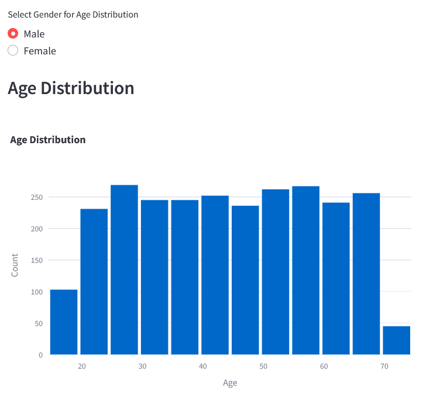

# Streamlit
* Open-source Python library, released in 2019, for building interactive web apps
* Designed for data scientists and machine learning engineers
* Enables rapid prototyping with minimal code
* [Documentation](https://docs.streamlit.io/)

## Installation and environment setup

### Venv
For Windows:
```
python -m venv .venv
.venv\Scripts\Activate.ps1
```

For Linux/MacOS:
```
python -m venv .venv
source .venv/bin/activate
```

Install required libraries (specified in requirements.txt):
```
pip install -r requirements.txt
```

Launch the project using:
```
streamlit run streamlit_app.py
```
OR
```
python -m streamlit run streamlit_app.py
```

### Docker
Make sure that Docker is installed and that the Docker Engine is running (Starting the Docker Desktop should do the trick)

Then while in the streamlit folder
```
docker compose up
```

## Project structure
```
├── streamlit_app.py
├── pages
    ├── graph.py
    ├── home.py
    ├── meteorites.py
    ├── streamlit-reference.py
    ├── todolist.py
```

## Functionality
- Graph page:
    1. Select stock instrument
    2. View price history over a selected period of time 
- Meteorites page:
    1. Select map modes
    2. View meteorite impact map
- Todo List:
    1. Add tasks to list
    2. Remove tasks from list
    3. Sort the tasks by date of creation
    4. Save the tasks to a .json file (automatic)
- Streamlit reference:
    1. Quick guide to streamlit syntax and functionality
---

# Streamlit multi-page app
## 1. App Layout

### 1.1. `streamlit_app.py`
This will be the main application file for the streamlit project. Create a file called **streamlit_app.py** in your **streamlit** folder:
```python
import streamlit as st

# In this section the pages for the app are added. Leave it empty for now and add pages as you go.
pages = [
    st.Page("<relative_path_to_file>", title="Example page", icon=":material/token:")
]

pg = st.navigation(pages, position="sidebar", expanded=True)

pg.run()
```

### 1.2. `graph.py`
#### 1.2.1. Imports
```python
import streamlit as st 
import yfinance as yf # Yahoo Finance is used for getting the stock data
import plotly.graph_objects as go # Plotly is used for plotting the data
```

#### 1.2.2. Getting the stock data

```python
def get_stock_data(symbol, period="1y", interval="1d"):
    """Fetch stock data from Yahoo Finance."""
    try:
        stock_data = yf.Ticker(symbol)
        stock_history = stock_data.history(period = period, interval = interval)
        if stock_history.empty:
            st.warning(f"No data available for {symbol} with period '{period}' and interval '{interval}'.")
            return None

        return stock_history
    except Exception as e:
        st.error(f"Error fetching data for {symbol}: {e}")
        return None
```

#### 1.2.3. Search button and plot creation
Create any necessary (or unnecessary) text and headers, add buttons which utilize the created functions. Use plotly to create the plot (or plots).
```python
st.write("## Search for a stock symbol")
stock_symbol = st.text_input("Enter stock symbol (e.g., AAPL, MSFT):", "AAPL", help="Start typing to see suggestions.")
suggested_symbols = ["AAPL", "MSFT", "GOOGL", "AMZN", "TSLA", "FB", "NFLX", "NVDA", "BABA", "INTC"]

if stock_symbol not in suggested_symbols:
    st.warning("Suggested symbols: " + ", ".join(suggested_symbols))

time_period = st.selectbox("Select time period:", ["1d", "5d", "1mo", "3mo", "6mo", "1y", "2y", "5y", "10y"])
interval = st.selectbox("Select interval:", ["1m", "5m", "15m", "30m", "1h", "4h", "1d", "1w", "1mo"])

if st.button("Search"):
    stock_data = get_stock_data(stock_symbol, time_period, interval)
    if stock_data is not None:
        st.divider()
        st.write(f"### You selected: {stock_symbol}")
        st.write("## Historical Data")
        st.dataframe(stock_data)

        try:
            st.divider()
            st.write("## Stock Price Candle Graph")
            fig = go.Figure(data=[go.Candlestick(
                x=stock_data.index,
                open=stock_data['Open'],
                high=stock_data['High'],
                low=stock_data['Low'],
                close=stock_data['Close']
            )])
            fig.update_layout(title=f"Candlestick Chart for {stock_symbol}", xaxis_title="Date", yaxis_title="Price")
            st.plotly_chart(fig)
        except Exception as e:
            st.error(f"Error plotting data: {e}")
    else:
        st.write("No data available")
```

#### 1.2.4. Adding the page to navigation
Add the page in the `pages` section of `app.py`.
```python
pages = [
    st.Page("pages/graph.py", title="Graphs", icon=":material/monitoring:")
]
```

### 1.3. `todolist.py`
#### 1.3.1. Imports
```python
import streamlit as st
import json # For saving the tasks in a json format and reading it from file
import os # For loading the locally saved tasks
```

#### 1.3.2. Functions
We create the necessary functions for notes/tasks manipulation
```python
# File to store notes
NOTES_FILE = "notes.json"

# Function to load notes from file
def load_notes():
    if os.path.exists(NOTES_FILE):
        with open(NOTES_FILE, "r") as file:
            return json.load(file)
    return []

# Function to save notes to file
def save_notes(notes):
    with open(NOTES_FILE, "w") as file:
        json.dump(notes, file)

# Function to remove notes
def remove_note(index):
    """Remove a note by index."""
    if 0 <= index < len(st.session_state["notes"]):
        st.session_state["notes"].pop(index)
        save_notes(st.session_state["notes"])
```

#### 1.3.3. Buttons, page layout and task saving
```python
# Initialize session state for notes
if "notes" not in st.session_state:
    st.session_state["notes"] = load_notes()

st.title("To-Do List")

# Input for new note
new_title = st.text_input("Note Title:")
new_note = st.text_area("Note Content:")

# Button to add the note
if st.button("Add Note"):
    if new_title.strip() and new_note.strip():  # Ensure title and content are not empty
        st.session_state["notes"].append({"title": new_title.strip(), "content": new_note.strip()})
        save_notes(st.session_state["notes"])  # Save notes to file
        st.success("Note added!")
    else:
        st.warning("Please enter both a title and content for the note.")

# Sorting options
sort_order = st.radio("Sort Notes By:", ("Oldest to Newest", "Newest to Oldest"))

# Display the list of notes
if st.session_state["notes"]:
    st.divider()
    st.subheader("Your Notes:")
    notes = st.session_state["notes"]
    if sort_order == "Newest to Oldest":
        notes = reversed(notes)
    for i, note in enumerate(notes, start=1):
        col1, col2 = st.columns([4, 1])
        with col1:
            st.write(f"**{i}. {note['title']}**")
            st.write(note["content"])
        with col2:
            if st.button("Remove", key=f"remove_{i}"):
                remove_note(i - 1)
                st.rerun()
else:
    st.info("No notes yet. Add your first note!")
```

## 2. Data/Resource Caching
## 2. Data/Resource Caching

Streamlit provides two main caching decorators to optimize performance:

### Data caching
- Use `@st.cache_data` to cache the results of data processing functions.
- Prevents redundant computations and speeds up repeated API calls or expensive operations.

Example:
```python
@st.cache_data
def get_expensive_data(param):
    # Simulate an expensive computation or API call
    import time
    time.sleep(2)
    return f"Result for {param}"

result = get_expensive_data("example")
st.write(result)
```

### Resource caching
- Use `@st.cache_resource` to cache global resources such as database connections or machine learning models.
- Ensures resources are created only once and reused across reruns.

Example:
```python
@st.cache_resource
def get_database_connection():
    import sqlite3
    conn = sqlite3.connect("my_database.db")
    return conn

db_conn = get_database_connection()
st.write("Database connection cached!")
```

## 3. Session State
Session state in Streamlit:
- Persists data across user interactions and script reruns
- Each browser tab or user has a separate session
- Useful for storing variables like counters, user inputs, or intermediate results
- Helps avoid unnecessary recalculations and maintains app state

Common use cases:
- Tracking user progress or selections
- Storing temporary data (e.g., form inputs, toggles)
- Managing multi-step workflows

Access session state with `st.session_state`:
- Use dictionary-like syntax: `st.session_state["key"]`
- Initialize variables if not present

Example:
```python
if "counter" not in st.session_state:
    st.session_state["counter"] = 0

st.write(f"Counter value: {st.session_state['counter']}")

if st.button("Increment"):
    st.session_state["counter"] += 1
```
## 4. Creating charts
Streamlit supports multiple ways to create charts and visualizations:

### Built-in chart functions
Streamlit provides simple APIs for common chart types:
```python
import streamlit as st
import pandas as pd
import numpy as np

data = pd.DataFrame(
    np.random.randn(50, 3),
    columns=["a", "b", "c"]
)

st.line_chart(data)
st.bar_chart(data)
st.area_chart(data)
```

### Using third-party libraries
You can use libraries like Matplotlib, Plotly, Altair, or Seaborn:
```python
import matplotlib.pyplot as plt

fig, ax = plt.subplots()
ax.plot(data["a"], data["b"])
st.pyplot(fig)
```
```python
import plotly.express as px

fig = px.scatter(data, x="a", y="b")
st.plotly_chart(fig)
```
```python
import altair as alt

chart = alt.Chart(data).mark_circle().encode(x="a", y="b")
st.altair_chart(chart)
```

### Tips
- Use interactive charts (e.g., Plotly, Altair) for better user experience.
- Streamlit automatically updates charts when data or inputs change.
- You can combine charts with widgets for dynamic visualizations.

## 5. Tasks
### 5.1. Customers Overview
Create a new page called **'Customers Overview'**

**Preview of the page:**



#### Description:
Note: Feel free to reinterpret those tasks as you wish. There is no need to make a carbon-copy of the presented charts.
* Season filters for all charts on the page
* Chart 1: Pie chart showing the gender distribution based on selected state and seasons 

* Chart 2: Map chart showing the amount of customers in each state, based on the selected age range and seasons

* Chart 3: Average rating chart, based on a selected category

* Chart 4: Age distribution chart, based on selected gender


#### Solutions
---
**Import data**
- <details>
    <summary>Import the customers.csv dataset</summary>
    ```python
    # Load data
    data_path = os.path.join('datasets', 'customers.csv')

    @st.cache_data 
    def load_data(path):
        return pd.read_csv(path)

    try:
        df = load_data(data_path)
    except FileNotFoundError:
        st.error(f"Could not find customers.csv at {data_path}")
        st.stop()
    ```
</details>

**Select seasons**
- <details>
    <summary>Solution: Add season selection to the sidebar</summary>

    ```python
    # Select seasons in sidebar
    selected_seasons = st.sidebar.multiselect(
        "Select Seasons",
        options=["Spring", "Summer", "Fall", "Winter"],
        default=["Spring", "Summer", "Fall", "Winter"]
    )
    ```
</details>

**Charts**
- <details>
    <summary>Solution: Gender Pie Chart</summary>

    ```python
    # Select region
    regions = df['State_name'].unique()
    selected_region = st.selectbox("Select Region", options=regions)

    # Filter data by selected region and selected seasons
    filtered_df = df[
        (df['State_name'] == selected_region) &
        (df['Season'].isin(selected_seasons))
    ]

    # Pie chart of genders
    gender_counts = filtered_df['Gender'].value_counts()
    st.subheader(f"Gender Distribution in {selected_region}")
    gender_counts_df = gender_counts.reset_index()
    gender_counts_df.columns = ['Gender', 'Count']
    fig = px.pie(
        gender_counts_df,
        names='Gender',
        values='Count',
        title='Gender Distribution'
    )
    st.plotly_chart(fig, use_container_width=True)
    ```
</details>

---

- <details>
    <summary>Solution: Map Chart</summary>

    ```python
    # Age filter
    min_age = int(df['Age'].min())
    max_age = int(df['Age'].max())
    age_range = st.slider(
        "Select Age Range",
        min_value=min_age,
        max_value=max_age,
        value=(min_age, max_age)
    )
    age_filtered_df = df[
        (df['Age'] >= age_range[0]) &
        (df['Age'] <= age_range[1]) &
        (df['Season'].isin(selected_seasons))
    ]
    state_counts = age_filtered_df['State_name'].value_counts().sort_values(ascending=False)

    st.subheader("Customer Count by State (Filtered by Age)")

    # Prepare state counts DataFrame for mapping
    state_counts_df = state_counts.reset_index()
    state_counts_df.columns = ['State_name', 'Customer_Count']
    
    # Mapping full state names to abbreviations (for Plotly)
    us_state_abbrev = {
        'Alabama': 'AL', 'Alaska': 'AK', 'Arizona': 'AZ', 'Arkansas': 'AR', 'California': 'CA',
        'Colorado': 'CO', 'Connecticut': 'CT', 'Delaware': 'DE', 'Florida': 'FL', 'Georgia': 'GA',
        'Hawaii': 'HI', 'Idaho': 'ID', 'Illinois': 'IL', 'Indiana': 'IN', 'Iowa': 'IA',
        'Kansas': 'KS', 'Kentucky': 'KY', 'Louisiana': 'LA', 'Maine': 'ME', 'Maryland': 'MD',
        'Massachusetts': 'MA', 'Michigan': 'MI', 'Minnesota': 'MN', 'Mississippi': 'MS', 'Missouri': 'MO',
        'Montana': 'MT', 'Nebraska': 'NE', 'Nevada': 'NV', 'New Hampshire': 'NH', 'New Jersey': 'NJ',
        'New Mexico': 'NM', 'New York': 'NY', 'North Carolina': 'NC', 'North Dakota': 'ND', 'Ohio': 'OH',
        'Oklahoma': 'OK', 'Oregon': 'OR', 'Pennsylvania': 'PA', 'Rhode Island': 'RI', 'South Carolina': 'SC',
        'South Dakota': 'SD', 'Tennessee': 'TN', 'Texas': 'TX', 'Utah': 'UT', 'Vermont': 'VT',
        'Virginia': 'VA', 'Washington': 'WA', 'West Virginia': 'WV', 'Wisconsin': 'WI', 'Wyoming': 'WY'
    }
    # Add a new column for state abbreviations
    state_counts_df['State_abbrev'] = state_counts_df['State_name'].map(us_state_abbrev)

    # Create a choropleth map
    fig = px.choropleth(
        state_counts_df,
        locations='State_abbrev',
        locationmode='USA-states',
        color='Customer_Count',
        color_continuous_scale='Blues',
        scope='usa',
        labels={'Customer_Count': 'Customer Count'},
        title='Customer Distribution by State'
    )
    fig.update_layout(margin={"r":0,"t":30,"l":0,"b":0}) 
    st.plotly_chart(fig, use_container_width=True)
    ```
</details>

---

- <details>
    <summary>Solution: Average Review Chart</summary>

    ```python
    # Select category
    categories = [
        "Age", "Gender", "Item", "Category", "Amount", "State_name", "Size", "Color",
        "Subscription", "Shipping", "Discount", "Promo_code", "Frequency"
    ]
    selected_category = st.selectbox("Select Category", options=categories, index=3)  # Default to 'Item'

    # Filter data by selected seasons
    review_df = df[df['Season'].isin(selected_seasons)]
    agg_review_df = review_df.groupby(selected_category)['Review_Rating'].mean().reset_index()

    # Bar chart of average review ratings
    fig = px.bar(
        agg_review_df,
        x=selected_category,
        y='Review_Rating',
        title=f'Average Review Rating by {selected_category}',
        labels={'Review_Rating': 'Average Review Rating', selected_category: selected_category}
    )
    fig.update_layout(xaxis_title=selected_category, yaxis_title='Average Review Rating')
    st.plotly_chart(fig, use_container_width=True)
    ```
</details>

---

- <details>
    <summary>Solution: Age Distribution Chart</summary>

    ```python
    genders = df['Gender'].unique()
    selected_gender = st.radio(
        "Select Gender for Age Distribution",
        options=genders,
        index=0
    )

    # Histogram: Age Distribution
    st.subheader("Age Distribution")
    age_df = df[
        (df['Season'].isin(selected_seasons)) &
        (df['Gender'] == selected_gender)
    ]
    fig = px.histogram(
        age_df,
        x='Age',
        nbins=25,
        title='Age Distribution',
        labels={'Age': 'Age'}
    )
    fig.update_layout(
        xaxis_title='Age',
        yaxis_title='Count',
        bargap=0.1
    )
    st.plotly_chart(fig, use_container_width=True)
    ```
</details>

**Whole page**
- <details>
    <summary>Whole page with code which was not included previously</summary>

    ```python
    import streamlit as st
    import pandas as pd
    import os
    import matplotlib.pyplot as plt
    import plotly.express as px

    # Load data
    data_path = os.path.join('datasets', 'customers.csv')

    @st.cache_data 
    def load_data(path):
        return pd.read_csv(path)

    try:
        df = load_data(data_path)
    except FileNotFoundError:
        st.error(f"Could not find customers.csv at {data_path}")
        st.stop()

    st.title("Customers Overview")
    st.write("This page provides an overview of customer demographics and distribution across different states and seasons.")

    # Display raw data in an expander
    with st.expander("Show raw data"):
        st.dataframe(df)

    # Select seasons in sidebar
    selected_seasons = st.sidebar.multiselect(
        "Select Seasons",
        options=["Spring", "Summer", "Fall", "Winter"],
        default=["Spring", "Summer", "Fall", "Winter"]
    )

    pie_chart_col, customer_map_col = st.columns(2)
    with pie_chart_col:
        # Select region
        regions = df['State_name'].unique()
        selected_region = st.selectbox("Select Region", options=regions)

        # Filter data by selected region and selected seasons
        filtered_df = df[
            (df['State_name'] == selected_region) &
            (df['Season'].isin(selected_seasons))
        ]

        # Pie chart of genders
        gender_counts = filtered_df['Gender'].value_counts()
        st.subheader(f"Gender Distribution in {selected_region}")
        gender_counts_df = gender_counts.reset_index()
        gender_counts_df.columns = ['Gender', 'Count']
        fig = px.pie(
            gender_counts_df,
            names='Gender',
            values='Count',
            title='Gender Distribution'
        )
        st.plotly_chart(fig, use_container_width=True)

    with customer_map_col:
        # Age filter
        min_age = int(df['Age'].min())
        max_age = int(df['Age'].max())
        age_range = st.slider(
            "Select Age Range",
            min_value=min_age,
            max_value=max_age,
            value=(min_age, max_age)
        )
        age_filtered_df = df[
            (df['Age'] >= age_range[0]) &
            (df['Age'] <= age_range[1]) &
            (df['Season'].isin(selected_seasons))
        ]
        state_counts = age_filtered_df['State_name'].value_counts().sort_values(ascending=False)

        st.subheader("Customer Count by State (Filtered by Age)")

        # Prepare state counts DataFrame for mapping
        state_counts_df = state_counts.reset_index()
        state_counts_df.columns = ['State_name', 'Customer_Count']
        
        # Mapping full state names to abbreviations (for Plotly)
        us_state_abbrev = {
            'Alabama': 'AL', 'Alaska': 'AK', 'Arizona': 'AZ', 'Arkansas': 'AR', 'California': 'CA',
            'Colorado': 'CO', 'Connecticut': 'CT', 'Delaware': 'DE', 'Florida': 'FL', 'Georgia': 'GA',
            'Hawaii': 'HI', 'Idaho': 'ID', 'Illinois': 'IL', 'Indiana': 'IN', 'Iowa': 'IA',
            'Kansas': 'KS', 'Kentucky': 'KY', 'Louisiana': 'LA', 'Maine': 'ME', 'Maryland': 'MD',
            'Massachusetts': 'MA', 'Michigan': 'MI', 'Minnesota': 'MN', 'Mississippi': 'MS', 'Missouri': 'MO',
            'Montana': 'MT', 'Nebraska': 'NE', 'Nevada': 'NV', 'New Hampshire': 'NH', 'New Jersey': 'NJ',
            'New Mexico': 'NM', 'New York': 'NY', 'North Carolina': 'NC', 'North Dakota': 'ND', 'Ohio': 'OH',
            'Oklahoma': 'OK', 'Oregon': 'OR', 'Pennsylvania': 'PA', 'Rhode Island': 'RI', 'South Carolina': 'SC',
            'South Dakota': 'SD', 'Tennessee': 'TN', 'Texas': 'TX', 'Utah': 'UT', 'Vermont': 'VT',
            'Virginia': 'VA', 'Washington': 'WA', 'West Virginia': 'WV', 'Wisconsin': 'WI', 'Wyoming': 'WY'
        }
        # Add a new column for state abbreviations
        state_counts_df['State_abbrev'] = state_counts_df['State_name'].map(us_state_abbrev)

        # Create a choropleth map
        fig = px.choropleth(
            state_counts_df,
            locations='State_abbrev',
            locationmode='USA-states',
            color='Customer_Count',
            color_continuous_scale='Blues',
            scope='usa',
            labels={'Customer_Count': 'Customer Count'},
            title='Customer Distribution by State'
        )
        fig.update_layout(margin={"r":0,"t":30,"l":0,"b":0}) 
        st.plotly_chart(fig, use_container_width=True)

    st.divider()

    review_col, age_col = st.columns(2)
    with review_col:
        # Select category
        categories = [
            "Age", "Gender", "Item", "Category", "Amount", "State_name", "Size", "Color",
            "Subscription", "Shipping", "Discount", "Promo_code", "Frequency"
        ]
        selected_category = st.selectbox("Select Category", options=categories, index=3)  # Default to 'Item'

        # Filter data by selected seasons
        review_df = df[df['Season'].isin(selected_seasons)]
        agg_review_df = review_df.groupby(selected_category)['Review_Rating'].mean().reset_index()

        # Bar chart of average review ratings
        fig = px.bar(
            agg_review_df,
            x=selected_category,
            y='Review_Rating',
            title=f'Average Review Rating by {selected_category}',
            labels={'Review_Rating': 'Average Review Rating', selected_category: selected_category}
        )
        fig.update_layout(xaxis_title=selected_category, yaxis_title='Average Review Rating')
        st.plotly_chart(fig, use_container_width=True)

    with age_col:
        # Gender selection for Age Distribution using radio buttons
        genders = df['Gender'].unique()
        selected_gender = st.radio(
            "Select Gender for Age Distribution",
            options=genders,
            index=0
        )

        # Histogram: Age Distribution
        st.subheader("Age Distribution")
        age_df = df[
            (df['Season'].isin(selected_seasons)) &
            (df['Gender'] == selected_gender)
        ]
        fig = px.histogram(
            age_df,
            x='Age',
            nbins=25,
            title='Age Distribution',
            labels={'Age': 'Age'}
        )
        fig.update_layout(
            xaxis_title='Age',
            yaxis_title='Count',
            bargap=0.1  # Add spacing between bars
        )
        st.plotly_chart(fig, use_container_width=True)
    ```
</details>